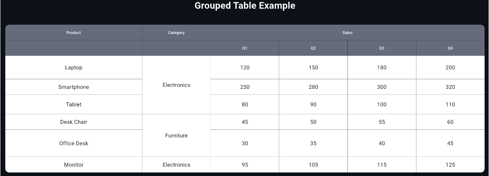

# flutter_grouped_table

[](https://pub.dev/packages/flutter_grouped_table)
[](https://github.com/JeHeeYu/flutter_grouped_table/blob/main/LICENSE)
[](https://pub.dev/packages/flutter_grouped_table)

A Flutter package for creating tables with merged cells (cell merge) support, especially useful for grouped headers.

## Features

- ✅ **Cell Merge Support**: Merge cells across multiple rows/columns in headers and data rows
- ✅ **Grouped Headers**: Automatic multi-row header layout with nested structures (e.g., "Sales" with "Q1", "Q2", "Q3", "Q4" sub-headers)
- ✅ **Row Span**: Explicit row span support in data cells
- ✅ **Column Span**: Column span support in both headers and data rows
- ✅ **Simple API**: Easy-to-use API for common use cases with simple data structures
- ✅ **Advanced API**: Full control with data models for complex scenarios
- ✅ **Customizable**: Customize cell styles, colors, borders, and more
- ✅ **Responsive**: Use flex weights to control column sizes

## Installation

Add this to your package's `pubspec.yaml` file:

```yaml
dependencies:
  flutter_grouped_table: ^1.0.1
```

Then run:

```bash
flutter pub get
```

## Usage

### Simple API (Recommended for Most Cases)

The simplest way to create a table is using `GroupedTable.fromSimpleData()`:

```dart
import 'package:flutter_grouped_table/flutter_grouped_table.dart';

GroupedTable.fromSimpleData(
  headerRows: [
    [
      'Product',
      'Category',
      {'text': 'Sales', 'children': ['Q1', 'Q2', 'Q3', 'Q4']}
    ]
  ],
  dataRows: [
    ['Laptop', 'Electronics', '120', '150', '180', '200'],
    ['Smartphone', null, '250', '280', '300', '320'],
    ['Tablet', null, '80', '90', '100', '110'],
  ],
  rowSpanMap: {
    0: {1: 3}, // Row 0, Column 1 spans 3 rows
  },
  columnFlexWeights: [2, 1, 1, 1, 1, 1],
  // Optional: control the overall table size
  // tableWidth: 900,
  // tableHeight: 500,
  // tableConstraints: const BoxConstraints(minWidth: 900),
)
```

**Key Points:**
- Use `null` in data rows to indicate a cell is merged from the previous row
- Use `rowSpanMap` to specify which cells span multiple rows: `{rowIndex: {colIndex: rowSpan}}`
- For grouped headers, use a Map: `{'text': 'Header', 'children': ['Sub1', 'Sub2']}`

### Row Span Example

To create vertically merged cells, use `rowSpanMap`:

```dart
GroupedTable.fromSimpleData(
  headerRows: [
    ['Product', 'Category', 'Q1', 'Q2', 'Q3', 'Q4']
  ],
  dataRows: [
    ['Laptop', 'Electronics', '120', '150', '180', '200'],
    ['Smartphone', null, '250', '280', '300', '320'], // null = merged from row 0
    ['Tablet', null, '80', '90', '100', '110'],       // null = merged from row 0
  ],
  rowSpanMap: {
    0: {1: 3}, // Row 0, Column 1 (Category) spans 3 rows
  },
)
```

### Per-row and Per-cell Heights

You can control row heights per-row using the `rowHeights` parameter (passed to `GroupedTable` or `fromSimpleData`). A `null` entry falls back to the global `rowHeight`.

```dart
// Make some rows taller than the default 40.0
GroupedTable.fromSimpleData(
  headerRows: [ /* ... */ ],
  dataRows: [ /* ... */ ],
  rowHeight: 40.0,
  rowHeights: const [60.0, 40.0, 50.0, 40.0, 70.0],
);
```

If you need to override the height of a specific data cell, build the advanced API and set `height` on a `GroupedTableDataCell`.

```dart
final dataRows = [
  [
    GroupedTableDataCell.text('Laptop'),
    GroupedTableDataCell(
      child: const Text('Electronics'),
      height: 80.0, // cell-specific override
      rowSpan: 1,
    ),
    // ...
  ],
  // ...
];

GroupedTable(
  headerRows: [ /* ... */ ],
  dataRows: dataRows,
  rowHeight: 40.0,
);
```

Notes:
- `GroupedTableDataCell.height` takes precedence over `rowHeights` and `rowHeight`.
- Row-spanned cell heights are calculated as the sum of the effective heights of the spanned rows plus `rowSpacing` between rows.


### Advanced API (Full Control)

For advanced use cases requiring custom widgets or fine-grained control:

```dart
final headerRow = [
  GroupedTableCell.simple('Product'),
  GroupedTableCell.simple('Category'),
  GroupedTableCell.grouped(
    text: 'Sales',
    children: [
      GroupedTableCell.simple('Q1'),
      GroupedTableCell.simple('Q2'),
      GroupedTableCell.simple('Q3'),
      GroupedTableCell.simple('Q4'),
    ],
  ),
];

final dataRows = [
  [
    GroupedTableDataCell.text('Laptop'),
    GroupedTableDataCell.rowSpan(
      child: const Text('Electronics'),
      rowSpan: 3,
    ),
    GroupedTableDataCell.text('120'),
    GroupedTableDataCell.text('150'),
    GroupedTableDataCell.text('180'),
    GroupedTableDataCell.text('200'),
  ],
  [
    GroupedTableDataCell.text('Smartphone'),
    GroupedTableDataCell.text('250'),
    GroupedTableDataCell.text('280'),
    GroupedTableDataCell.text('300'),
    GroupedTableDataCell.text('320'),
  ],
];

GroupedTable(
  headerRows: [headerRow],
  dataRows: dataRows,
  columnFlexWeights: [2, 1, 1, 1, 1, 1],
)
```

## API Reference

### GroupedTable.fromSimpleData

Factory constructor for creating tables from simple data structures.

#### Parameters

- `headerRows` (required): List of header rows. Each row can contain:
  - `String`: Simple header text
  - `Map`: Grouped header with `{'text': 'Header', 'children': ['Sub1', 'Sub2']}`
- `dataRows` (required): List of data rows. Each cell can be:
  - `String`: Text content
  - `Widget`: Custom widget
  - `null`: Merged cell (skipped, part of rowSpan from previous row)
  - `TableCellData`: Advanced cell configuration
- `rowSpanMap`: Map specifying row spans: `{rowIndex: {colIndex: rowSpan}}`
- `columnFlexWeights`: Flex weights for columns
- `borderColor`: Border color (default: `Colors.black`)
- `borderWidth`: Border width (default: `1.0`)
- `borderRadius`: Table border radius
- `headerBackgroundColor`: Background color for header cells
- `dataBackgroundColor`: Background color for data cells
- `headerTextStyle`: Default text style for headers
- `dataTextStyle`: Default text style for data cells
- `defaultHeaderHeight`: Default header cell height (default: `40.0`)
- `rowHeight`: Default data row height (default: `40.0`)
- `rowSpacing`: Vertical spacing between rows (default: `0`)

### GroupedTable

Main table widget (advanced API).

#### Properties

- `headerRows` (required): List of header row configurations (`List<List<GroupedTableCell>>`)
- `dataRows` (required): List of data rows (`List<List<GroupedTableDataCell>>`)
- `columnFlexWeights`: Flex weights for columns
- `borderColor`: Border color (default: `Colors.black`)
- `borderWidth`: Border width (default: `1.0`)
- `borderRadius`: Table border radius
- `headerBackgroundColor`: Background color for header cells
- `dataBackgroundColor`: Background color for data cells
- `headerTextStyle`: Default text style for headers
- `dataTextStyle`: Default text style for data cells
- `defaultHeaderHeight`: Default header cell height (default: `40.0`)
- `rowHeight`: Default data row height (default: `40.0`)
- `rowSpacing`: Vertical spacing between rows (default: `0`)

### GroupedTableCell

Represents a header cell in the table.

#### Constructors

- `GroupedTableCell()`: Default constructor
- `GroupedTableCell.simple(String text)`: Simple text cell
- `GroupedTableCell.merged()`: Merged cell spanning multiple columns/rows
- `GroupedTableCell.grouped()`: Grouped header with nested children (automatically creates multi-row header)

### GroupedTableDataCell

Represents a data cell in the table.

#### Constructors

- `GroupedTableDataCell()`: Default constructor with `child` widget
- `GroupedTableDataCell.text(String text)`: Simple text cell
- `GroupedTableDataCell.merged()`: Merged cell spanning multiple columns/rows
- `GroupedTableDataCell.rowSpan()`: Cell with row span

### TableCellData

Helper class for advanced cell configuration in simple API.

#### Constructors

- `TableCellData.text(String text)`: Simple text cell
- `TableCellData.rowSpan(dynamic value, int rowSpan)`: Cell with row span
- `TableCellData.empty()`: Empty cell (for merged cells)

## Example

See the `example/` folder for more examples.



<br>

```bash
cd example
flutter run
```

## License

MIT License

Copyright (c) 2026 JeHee Yu
